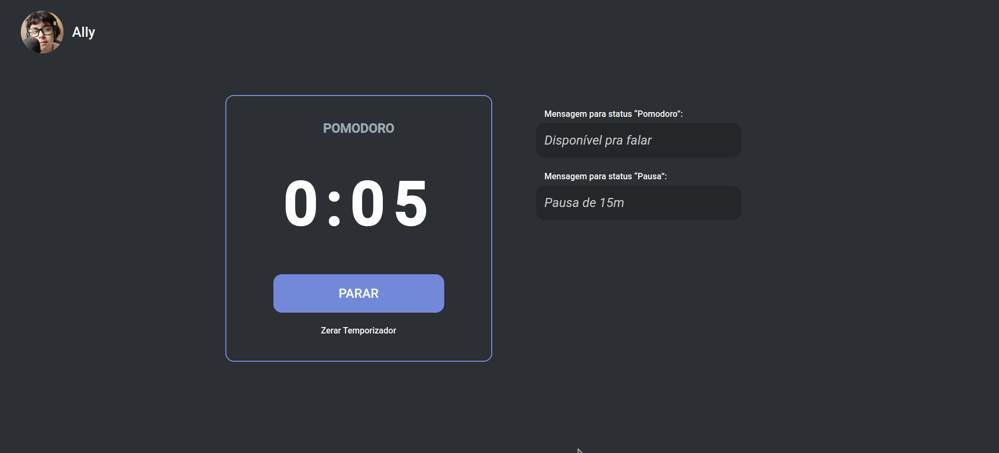

<h1 align="center">🕔 Discordpomo</h1>

Pomodoro website integrated with Discord API

 

 

## 💡 What is it?
Discordpomo is a project done live on Twitch. It is a stopwatch that follows the Pomodoro technique and changes the user's Discord status according to the timer.

## 🖥 Setup
- Clone the repository
- Create and fill `.env` file
- Run `npm install` to install dependecies
- Run `npm run dev` to run the project

## 🚧 Built With
- ReactJS
- TypeScript